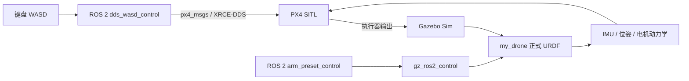

# clean-UAV-simulation

## Current verification status (steps 4-10)

The reproducible verification record is [drone_sim_ws/analysis/第4-10步实测验收记录.md](drone_sim_ws/analysis/第4-10步实测验收记录.md).

Useful WSL commands for the current worktree:

```bash
cd /mnt/e/清洁无人机/drone_sim_ws
source /opt/ros/jazzy/setup.bash
source /home/asus/ros2_px4_build_ws/install/setup.bash
source install/setup.bash
PYTHONPATH=src/drone_arm_sim python3 scripts/validate_motor_battery_dynamics.py
python3 scripts/test_ros2_dds_wasd_pty.py --timeout 100
ARM_FLIGHT_PROFILE=micro python3 scripts/test_ros2_dds_arm_flight_pty.py --timeout 100
PYTHONPATH=src/drone_arm_sim python3 scripts/analyze_arm_coupling.py
```

The default baseline keeps battery dynamics disabled. To run an isolated
experimental battery case without editing the baseline JSON, set
`BATTERY_DYNAMICS_ENABLED=true` and pass the desired resistance/capacity to
`wsl_start_ros2_dds_noarm.sh`. Full arm work profiles remain diagnostic only;
the accepted flight profile is `ARM_FLIGHT_PROFILE=micro`.

基于真实 CAD 总装的 `my_drone` 八旋翼无人机＋SO101 机械臂仿真工程。项目在默认 WSL（Ubuntu 24.04）中运行，使用 ROS 2 Jazzy、Gazebo Sim、`gz_ros2_control` 和 PX4 SITL，实现 PX4 飞行控制、ROS 2 机械臂关节控制以及 WASD 键盘操控。

This repository contains a CAD-based octocopter simulation with an SO101 arm. PX4 is responsible for flight control, while ROS 2 / `ros2_control` drives the arm. The vehicle model, motor allocation and launch scripts are kept reproducible so that the simulation can be calibrated with measured propeller data later.

## 当前正式版本

- 几何基准：`零件/` 中的完整 CAD 总装；不使用早期的 0.35 m 虚拟旋翼布局。
- 正式整机质量：**7.735 kg**（当前仿真冻结值）。CAD 材料密度估算得到的 8.567252 kg 仅作为审计证据保存，不作为飞行质量。
- 正式 URDF：`drone_sim_ws/src/drone_arm_sim/urdf/my_drone_v3/my_drone_cad_formal_dynamic.urdf`
- 正式飞行参数：`drone_sim_ws/src/drone_arm_sim/config/my_drone_v3_cad_7p735_flight.json`
- PX4 airframe：`drone_sim_ws/px4/airframes/4026_gz_my_drone_octorotor_7p735`
- 单电机额定上限：`1.2 kgf = 11.76798 N`；静态分段推力曲线下，正式悬停解最大单电机约 `11.335426 N`。
- PX4 悬停参数：`MPC_THR_HOVER=0.8737`。

## 系统架构



飞行与机械臂控制通道解耦，但机械臂连杆的质量、质心和惯量仍属于同一动力学刚体树；机械臂运动会真实地改变重心、惯量并产生姿态扰动。

## 目录

```text
零件/                                      CAD 总装、零件与导出网格（几何唯一来源）
drone_sim_ws/
  src/drone_arm_sim/                       URDF、动力学配置、机械臂节点和测试
  src/drone_arm_sim/urdf/my_drone_v3/      正式可动模型
  src/drone_arm_sim/config/                电机分配、推力曲线和质量配置
  scripts/                                 WSL 启动、WASD、回归测试和诊断脚本
  px4/airframes/                           项目专用 PX4 机型
  启动说明_7p735正式版.md                   逐步启动手册
  完成审计_7p735正式版.md                   参数、测试和已知限制
```

## 环境要求

- Windows + 默认 WSL 发行版 `Ubuntu-24.04`
- ROS 2 Jazzy
- Gazebo Sim（当前脚本按 Gazebo 8 配置）
- PX4 SITL、Micro XRCE-DDS Agent
- Python 3、`pytest`、ROS 2 `px4_msgs`

建议在 WSL 内使用 Linux 原生的 ROS 2/PX4 工具链，不要让 Windows Miniforge 或其他 protobuf 动态库污染 PX4 运行环境。

## 构建

```bash
cd /mnt/e/清洁无人机/drone_sim_ws
source /opt/ros/jazzy/setup.bash
colcon build --symlink-install --packages-select drone_arm_sim px4_ros2_control
source install/setup.bash
```

如果重新生成了 PX4 airframe，执行：

```bash
bash scripts/wsl_install_px4_airframe.sh
```

## 启动正式仿真

在 PowerShell 中运行（会启动 Gazebo、PX4、Micro XRCE-DDS Agent 和 ROS 2 机械臂控制器）：

```powershell
wsl.exe -d Ubuntu-24.04 -- bash -lc "cd '/mnt/e/清洁无人机/drone_sim_ws' && HEADLESS=false ENABLE_ARM_CONTROL=true bash scripts/wsl_start_ros2_dds.sh"
```

看到以下标志表示 ROS 2 与 PX4 链路已就绪：

```text
ROS2_DDS_READY arm_control=true
```

只验证飞行、不加载机械臂控制器时：

```powershell
wsl.exe -d Ubuntu-24.04 -- bash -lc "cd '/mnt/e/清洁无人机/drone_sim_ws' && HEADLESS=false ENABLE_ARM_CONTROL=false bash scripts/wsl_start_ros2_dds_noarm.sh"
```

## WASD 手动飞行

保持上面的仿真终端运行，在第二个 PowerShell 窗口执行：

```powershell
powershell -ExecutionPolicy Bypass -File "E:\清洁无人机\drone_sim_ws\scripts\start_ros2_dds_wasd.ps1"
```

控制终端必须保持焦点：

| 按键 | 动作 |
|---|---|
| `T` | 进入 Offboard、解锁并起飞到约 1.2 m |
| `W` / `S` | 机头方向前进 / 后退 |
| `A` / `D` | 机体左移 / 右移 |
| `R` / `F` | 上升 / 下降 |
| `Q` / `E` | 左偏航 / 右偏航 |
| `L` | 自动降落并解除武装 |
| `O` | 退出 Offboard，请求位置控制 |
| `Z` | 未解锁时安全退出；已解锁时先请求降落 |
| 连按两次 `X` | 失控时紧急解除武装（仅紧急使用） |

不要同时启动旧版 `px4_wasd_control.py` 或其他 pymavlink Offboard 节点，以免多个控制器争抢同一 PX4 实例。

## 机械臂控制

机械臂可在地面执行完整预设动作：

```bash
cd /mnt/e/清洁无人机/drone_sim_ws
bash scripts/run_ros2_arm_preset.sh work_a 3
bash scripts/run_ros2_arm_preset.sh work_b 3
bash scripts/run_ros2_arm_preset.sh retracted 3
```

飞行验收只使用幅度受限、渐进的 `flight_micro_a`、`flight_micro_b` 和 `retracted`。`flight_work_a/b` 实飞曾产生约 `12.6 m` 水平漂移，完整 `work_a/work_b` 的风险更高，因此两者都不属于默认飞行动作。

启用机械臂控制时，启动文件会同时运行 `arm_coupling_monitor`，实时计算总质心、惯量、关节运动反作用力/力矩，并发布：

- `/my_drone/arm_reaction_wrench_body`
- `/my_drone/arm_feedforward_acceleration_ned`

前馈默认只计算和记录，不注入 PX4。完成无前馈基线后，可在 WASD 控制终端中设置 `ARM_FEEDFORWARD_ENABLED=true` 进行 A/B 试验。前馈限幅默认 `0.6 m/s²`。

## 测试与验收

静态单元测试：

```bash
cd /mnt/e/清洁无人机/drone_sim_ws
source /opt/ros/jazzy/setup.bash
PYTHONPATH=src/drone_arm_sim pytest -q src/drone_arm_sim/test/test_core.py
```

当前结果：`27 passed`。

启动正式后端后，可运行：

```bash
source /home/asus/ros2_px4_build_ws/install/setup.bash
source install/setup.bash
python3 scripts/test_ros2_dds_wasd_pty.py --timeout 100
ARM_FLIGHT_PROFILE=micro python3 scripts/test_ros2_dds_arm_flight_pty.py --timeout 130
PYTHONPATH=src/drone_arm_sim python3 scripts/analyze_arm_coupling.py
PYTHONPATH=src/drone_arm_sim python3 scripts/rl_env_smoke_test.py --task hover --steps 200
```

通过标志：`DDS_WASD_PTY_PASS`、`DDS_ARM_FLIGHT_PASS`、`ARM_COUPLING_ANALYSIS_PASS`。最近一次 `flight_micro_a/b` 机械臂安全飞行测试的水平漂移约 `0.357 m`、高度跨度约 `1.450 m`，无 failsafe，并正常降落解除武装。

## 第 11 步：离线 RL 接口

`drone_sim_ws/src/drone_arm_sim/drone_arm_sim/rl_env.py` 提供一个与正式
CAD 配置共享推力分配、电池模型和 SO101 质量/质心/惯量模型的离线
Gymnasium 兼容环境。动作是 8 个归一化电机命令加 6 个关节速度命令，
观测维度为 25。它已经通过 `rl_env_smoke_test.py` 和核心回归测试，但
明确不是 PX4/Gazebo-in-the-loop；接触、完整姿态和真实电机闭环仍需在
Gazebo 中验证后才能用于训练策略。

## 已知限制与后续标定

当前版本用于功能和控制链路验证，仍需用实测数据提高真实性：

- 4/5/7/8 的反向螺距和推力方向是当前假设，需用桨叶螺距或台架试验确认。
- `RPM—推力—扭矩`、反扭矩系数、电机/电调延迟、电池内阻、风场和地面效应尚未完成实机标定。
- 完整机械臂飞行动作会导致较大姿态/位置扰动；应先增加推力余量、动作限幅和控制器补偿，再进行动态作业飞行。
- CAD 几何来自 `零件/`，但 7.735 kg 是当前冻结的工程配置；更换称重或惯量数据后需要重新生成 URDF、控制分配矩阵和 PX4 参数。

详细步骤和审计记录见：[启动说明_7p735正式版.md](drone_sim_ws/启动说明_7p735正式版.md) 和 [完成审计_7p735正式版.md](drone_sim_ws/完成审计_7p735正式版.md)。

当前可飞版本已冻结为回退基线，详见：[BASELINE_7P735_FLYABLE.md](BASELINE_7P735_FLYABLE.md)。后续校准和机械臂耦合实验应从标签 `baseline-7p735-flyable` 创建独立分支，不覆盖正式模型。

物理事实冻结记录见：[电机物理冻结表_第2步.md](drone_sim_ws/analysis/电机物理冻结表_第2步.md) 和 [质量重心惯量表_第3步.md](drone_sim_ws/analysis/质量重心惯量表_第3步.md)。其中明确区分 CAD 几何事实、用户安装表、临时飞行假设和待校准参数。

第 4～5 步的动力学接口、分配矩阵和饱和验收见：[动力学与分配验收_第4-5步.md](drone_sim_ws/analysis/动力学与分配验收_第4-5步.md)。

## 安全与贡献

本项目仅用于仿真。任何真实飞行前必须独立验证结构强度、旋向、推力、失效保护和遥控链路。不要把 GitHub Personal Access Token、私钥或本地凭据写入 README、脚本、日志或 Git 历史；提交前请检查敏感信息。
