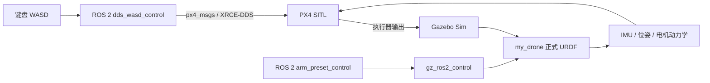

# clean-UAV-simulation

## Base 1 联合补偿最新验收（2026-08-13）

4 kg Base 1 已通过 SO101 动作 6 的完整联合实测：末端伸出 `0.10 m / 90 s`、保持 `8 s`、`90 s` 原路收回。世界 X/Y 峰峰值分别为 `0.035 / 0.033 m`，高度 `0.011 m`，最大倾角 `0.6°`，无电机饱和、failsafe 或异常落地。WASD 水平输入整形更新为 `0.15 m/s²`、`0.30 m/s³` 后，`0.40 m/s` 目标的实测峰值为 `0.437 m/s`，并完成起飞、各向速度、H 悬停和正常降落。

完整机制、参数、原始日志和复现命令见 [Base 1 机械臂六维补偿最终验收](drone_sim_ws/analysis/base1/Base_1_机械臂六维补偿最终验收_20260813.md)。该结论仅适用于 4 kg Base 1；7.735 kg 正式质量版本仍需单独校准。

## Current verification status (steps 4-10)

The reproducible verification record is [drone_sim_ws/analysis/第4-10步实测验收记录.md](drone_sim_ws/analysis/第4-10步实测验收记录.md).

Useful WSL commands for the current worktree:

```bash
cd /mnt/e/清洁无人机/drone_sim_ws
source /opt/ros/jazzy/setup.bash
source /home/asus/ros2_px4_build_ws/install/setup.bash
source install/setup.bash
export PYTHONPATH="$PWD/src/drone_arm_sim:${PYTHONPATH:-}"
python3 scripts/validate_motor_battery_dynamics.py
python3 scripts/test_ros2_dds_wasd_pty.py --timeout 100
ARM_TORQUE_ABORT_NM=0.8 ARM_FLIGHT_PROFILE=micro \
  python3 scripts/test_ros2_dds_arm_flight_pty.py --timeout 180
python3 scripts/analyze_arm_coupling.py
```

The default baseline keeps battery dynamics disabled. To run an isolated
experimental battery case without editing the baseline JSON, set
`BATTERY_DYNAMICS_ENABLED=true` and pass the desired resistance/capacity to
`wsl_start_ros2_dds_noarm.sh`. Full arm work profiles remain diagnostic only;
the accepted flight profile is `ARM_FLIGHT_PROFILE=micro`.

### Latest clean WSL acceptance (2026-08-08)

- No-arm `T→W→D→S→A→Q→E→L`: `DDS_WASD_PTY_PASS`, no failsafe, horizontal
  error `0.228 m`, yaw range `5.0 deg`, actuator saturation `0%`.
- Experimental battery dynamics (`0.5 mΩ`, `20 Ah`): hover/land completed with
  no failsafe; loaded voltage was about `14.67 V` and thrust scale about
  `0.983`. The default baseline remains battery-disabled until real pack data
  are available.
- Ground arm presets: `ARM_GROUND_PRESETS_PASS`, maximum tracking error about
  `0.080 rad`.
- Low-amplitude arm flight with feed-forward off has produced
  `DDS_ARM_FLIGHT_PASS`; a later recorded repeat completed all arm presets with
  a `0.091 m` / `0.090 m` action window but timed out during PX4 LAND, so
  landing repeatability remains an open gate.
- The experimental rotor-torque feed-forward path is default-off.  A `0.05 N`
  run completed with `0.104 m` horizontal drift and `0.139 m` altitude span,
  but did not improve both windows relative to the recorded feed-forward-off
  action window; the paired comparison is therefore not accepted as an
  improvement.

### 2026-08-11 deterministic 4 kg status

- Startup tests now fix Gazebo seed `4027`, use a fresh PX4 work directory and
  require five seconds of stable ground state before takeoff. Two repeated
  gripper flights reduced the PX4 ground-origin difference from `0.433 m` to
  `0.009 m`; see
  `drone_sim_ws/analysis/flight_start_reproducibility_4kg_20260811.json`.
- A deterministic static-COM gain `0.5` pair was rejected: horizontal drift
  changed from `0.072 m` to `0.151 m`, although altitude span improved from
  `0.174 m` to `0.150 m`. Predictive reaction/static-COM compensation remains
  disabled.
- A new sensor-side torque disturbance-observer candidate uses PX4 gyro,
  actual motor commands, CAD lever arms and online inertia/COM without Gazebo
  truth. It is independently gated, bounded and default-off; `60` focused
  tests and an observe-only live smoke test pass. It is not accepted until a
  deterministic full-extension OFF/ON pair passes. See
  `drone_sim_ws/analysis/arm_torque_dob_candidate_4kg_20260811.md`.

The latest clean rerun with the reaction-torque safety gate installed is saved
in `drone_sim_ws/analysis/wasd_clean_runtime_pass.log`: no failsafe,
horizontal error `0.947 m`, height error `1.248 m`, yaw range `5.8 deg`,
maximum actuator output `1000`, and saturation fraction `1.61%`.

The matched A/B result can be regenerated with
`python3 scripts/compare_arm_flight_ab.py --feedforward-off <log-off> --feedforward-on <log-on>`;
the JSON report records the gate decision instead of relying on the test
process exit marker alone.

The formal CAD rotor table and allocation matrix can be printed directly with:

```bash
PYTHONPATH=src/drone_arm_sim python3 -m drone_arm_sim.allocation_analysis \
  --config src/drone_arm_sim/config/my_drone_v3_cad_7p735_flight.json
```

The detailed evidence and explicit provisional assumptions are in
`drone_sim_ws/analysis/第4-10步实测验收记录.md`.

基于真实 CAD 总装的 `my_drone` 八旋翼无人机＋SO101 机械臂仿真工程。项目在默认 WSL（Ubuntu 24.04）中运行，使用 ROS 2 Jazzy、Gazebo Sim、`gz_ros2_control` 和 PX4 SITL，实现 PX4 飞行控制、ROS 2 机械臂关节控制以及 WASD 键盘操控。

This repository contains a CAD-based octocopter simulation with an SO101 arm. PX4 is responsible for flight control, while ROS 2 / `ros2_control` drives the arm. The vehicle model, motor allocation and launch scripts are kept reproducible so that the simulation can be calibrated with measured propeller data later.

## 当前正式版本

- 几何基准：`零件/` 中的完整 CAD 总装；不使用早期的 0.35 m 虚拟旋翼布局。
- 正式整机质量：**7.735 kg**（当前仿真冻结值）。CAD 材料密度估算得到的 8.567252 kg 仅作为审计证据保存，不作为飞行质量。
- 正式 URDF：`drone_sim_ws/src/drone_arm_sim/urdf/my_drone_v3/my_drone_cad_formal_dynamic.urdf`
- 正式飞行参数：`drone_sim_ws/src/drone_arm_sim/config/my_drone_v3_cad_7p735_flight.json`
- PX4 airframe：`drone_sim_ws/px4/airframes/4026_gz_my_drone_octorotor_7p735`
- 单电机额定上限：`1.2 kgf = 11.76798 N`；静态分段推力曲线下，正式悬停解最大单电机约 `11.335426 N`。
- PX4 悬停参数：`MPC_THR_HOVER=0.8500`；命令到推力在悬停区保持单一斜率，额定推力在命令约 `0.9136` 处封顶。

## 系统架构



飞行与机械臂控制通道解耦，但机械臂连杆的质量、质心和惯量仍属于同一动力学刚体树；机械臂运动会真实地改变重心、惯量并产生姿态扰动。

## 目录

```text
零件/                                      CAD 总装、零件与导出网格（几何唯一来源）
drone_sim_ws/
  src/drone_arm_sim/                       URDF、动力学配置、机械臂节点和测试
  src/drone_arm_sim/urdf/my_drone_v3/      正式可动模型
  src/drone_arm_sim/config/                电机分配、推力曲线和质量配置
  scripts/                                 WSL 启动、WASD、回归测试和诊断脚本
  px4/airframes/                           项目专用 PX4 机型
  启动说明_7p735正式版.md                   逐步启动手册
  完成审计_7p735正式版.md                   参数、测试和已知限制
```

## 环境要求

- Windows + 默认 WSL 发行版 `Ubuntu-24.04`
- ROS 2 Jazzy
- Gazebo Sim（当前脚本按 Gazebo 8 配置）
- PX4 SITL、Micro XRCE-DDS Agent
- Python 3、`pytest`、ROS 2 `px4_msgs`

建议在 WSL 内使用 Linux 原生的 ROS 2/PX4 工具链，不要让 Windows Miniforge 或其他 protobuf 动态库污染 PX4 运行环境。

## 构建

```bash
cd /mnt/e/清洁无人机/drone_sim_ws
source /opt/ros/jazzy/setup.bash
colcon build --symlink-install --packages-select drone_arm_sim px4_ros2_control
source install/setup.bash
```

如果重新生成了 PX4 airframe，执行：

```bash
bash scripts/wsl_install_px4_airframe.sh
```

## 启动正式仿真

在 PowerShell 中运行（会启动 Gazebo、PX4、Micro XRCE-DDS Agent 和 ROS 2 机械臂控制器）：

```powershell
wsl.exe -d Ubuntu-24.04 -- bash -lc "cd '/mnt/e/清洁无人机/drone_sim_ws' && HEADLESS=false ENABLE_ARM_CONTROL=true bash scripts/wsl_start_ros2_dds.sh"
```

看到以下标志表示 ROS 2 与 PX4 链路已就绪：

```text
ROS2_DDS_READY arm_control=true
```

只验证飞行、不加载机械臂控制器时：

```powershell
wsl.exe -d Ubuntu-24.04 -- bash -lc "cd '/mnt/e/清洁无人机/drone_sim_ws' && HEADLESS=false ENABLE_ARM_CONTROL=false bash scripts/wsl_start_ros2_dds_noarm.sh"
```

## WASD 手动飞行

保持上面的仿真终端运行，在第二个 PowerShell 窗口执行：

```powershell
E:\清洁无人机\drone_sim_ws\scripts\start_wasd_control_windows.cmd
```

控制终端必须保持焦点：

| 按键 | 动作 |
|---|---|
| `T` | 进入 Offboard、解锁并起飞到约 1.2 m |
| `W` / `S` | 单击或长按均只锁存 `+0.40 / -0.40 m/s` 前后速度 |
| `A` / `D` | 单击或长按均只锁存 `0.40 m/s` 左右速度 |
| `R` / `F` | 单击或长按均只锁存 `0.15 m/s` 上升 / 下降速度 |
| `Q` / `E` | 单击或长按均只锁存 `15 deg/s` 左 / 右偏航速度 |
| 松开方向键 | 不改变已经锁存的目标速度 |
| `H` | 目标速度改为零，经 S 曲线制动并锁存停止后的航向 |
| `L` | 自动降落并解除武装 |
| `O` | 退出 Offboard，请求位置控制 |
| `Z` | 未解锁时安全退出；已解锁时先请求降落 |
| 连按两次 `X` | 失控时紧急解除武装（仅紧急使用） |

Windows 启动器只在按键从“未按下”变成“按下”的边沿发送一次命令，因此长按不会依赖键盘自动连发，也不会重复累加速度；松开和窗口失焦均不会修改锁存目标。需要停止时必须明确按 `H`。启动前会终止遗留的 `dds_wasd_control`，确保同一 PX4 实例只有一个手动控制节点。不要同时启动旧版 `px4_wasd_control.py` 或其他 pymavlink Offboard 节点。

锁存目标经过独立 S 曲线发生器再送入 PX4。当前 4 kg 实飞验证参数为：

| 通道 | 最大速度 | 最大加速度 | 最大 jerk |
|---|---:|---:|---:|
| 水平 | `0.40 m/s` | `0.30 m/s²` | `0.60 m/s³` |
| 垂直 | `0.15 m/s` | `0.18 m/s²` | `0.40 m/s³` |
| 偏航 | `15°/s` | `20°/s²` | 角速度斜坡 |

最初建议的垂直 `0.20 m/s²` 在干净 R→F→Q 回归中产生约 `11.3%`
超调，降低到 `0.18 m/s²` 后约为 `2.0%`。偏航建议初值 `30°/s²` 在
Q→E 反转时产生约 `0.223 m/s` 垂向耦合，降低到 `20°/s²` 后约为
`0.035 m/s`，偏航超调约 `2.7%`；这两个偏离属于实测调优结果，不是漏配。

## 机械臂控制

在第三个 PowerShell 窗口启动机械臂键盘：

```powershell
powershell -ExecutionPolicy Bypass -File "E:\清洁无人机\drone_sim_ws\scripts\start_ros2_arm_keyboard.ps1"
```

空中优先使用 `1`、`2`、`3`（小幅工作姿态 A/B、收回）。`6` 是明显可见的完整演示：末端沿 CAD 工具轴直线伸出、保持、再沿原路径收回。地面使用 `0.12 m / 8 s`，检测到已解锁时自动切换为较安全的 `0.10 m / 30 s` 并在完成后留出 10 秒稳定时间。`4`、`5` 是完整诊断姿态，当前只建议地面使用。

当前空中 `6` 已在独立 4 kg 调试机型完成一次全程与正常降落验证，但仍出现约 `0.822 m` 水平漂移和 `0.913 m` 高度跨度；这说明“按 6 立即掉地”的故障已被限速方案规避，但还不能宣称机械臂动作期间实现高精度悬停。正式 `7.735 kg` 版本推力余量更小，暂不接受该大动作。

机械臂可在地面执行完整预设动作：

```bash
cd /mnt/e/清洁无人机/drone_sim_ws
bash scripts/run_ros2_arm_preset.sh work_a 3
bash scripts/run_ros2_arm_preset.sh work_b 3
bash scripts/run_ros2_arm_preset.sh retracted 3
```

默认飞行仍只使用幅度受限的 `flight_micro_a`、`flight_micro_b` 和 `retracted`。完整 `work_a` 已用 90 秒展开、90 秒收回的诊断轨迹通过一次严格飞行验收；完整 `work_b` 已独立测试，但因反作用力矩和高度偏差触发安全 LAND，尚未通过。

启用机械臂控制时，启动文件会同时运行 `arm_coupling_monitor`，实时计算总质心、惯量、关节运动反作用力/力矩，并发布：

- `/my_drone/arm_reaction_wrench_body`
- `/my_drone/arm_feedforward_acceleration_ned`

前馈默认只计算和记录，不注入 PX4。完成无前馈基线后，可在 WASD 控制终端中设置 `ARM_FEEDFORWARD_ENABLED=true` 进行 A/B 试验。前馈限幅默认 `0.6 m/s²`。

## 测试与验收

静态单元测试：

```bash
cd /mnt/e/清洁无人机/drone_sim_ws
source /opt/ros/jazzy/setup.bash
source /home/asus/ros2_px4_build_ws/install/setup.bash
source install/setup.bash
python3 -m pytest -q src/drone_arm_sim/test src/px4_ros2_control/test
```

当前飞行与机械臂核心回归结果：`78 passed`（3 个上游 protobuf 弃用警告）。

启动正式后端后，可运行：

```bash
source /home/asus/ros2_px4_build_ws/install/setup.bash
source install/setup.bash
python3 scripts/test_ros2_dds_wasd_pty.py --timeout 100
ARM_FLIGHT_PROFILE=micro python3 scripts/test_ros2_dds_arm_flight_pty.py --timeout 130
python3 scripts/analyze_arm_coupling.py
python3 scripts/rl_env_smoke_test.py --task hover --steps 200
```

通过标志：`DDS_VELOCITY_WASD_PASS`、`DDS_ARM_FLIGHT_PASS`、`ARM_COUPLING_ANALYSIS_PASS`。修复物理步施力后，4 kg 调试机型的完整 `W/S/A/D/R/F/Q/E/W/H` 速度序列实测为：水平峰值 `0.422 m/s`、垂直峰值 `0.147 m/s`、偏航峰值 `15.4 deg/s`、电机饱和率 `0`，无 failsafe 并正常 LAND/解除武装。独立 Q/E/H 的最大非指令垂直速度为 `0.027 m/s`。这些数据只验收调试控制链，不替代 7.735 kg 正式机的真实桨型和推力余量验收。

机械臂空中耦合按单关节逐级验收。仅夹爪开合已通过；仅腕部滚转约
`0.20 rad`、单程 `12 s` 的伸出/返回也已通过：两个动作窗口水平漂移
`0.094/0.089 m`，高度跨度 `0.091/0.070 m`，最大真值倾角 `0.894°`，
最大反作用力矩 `0.035 N·m`，无电机饱和和 failsafe，并正常 LAND/解除武装。
原 `0.30 rad / 10 s` 运行的超门限证据仍保留，未通过放宽门限覆盖。

后续 4 kg 阶梯也已通过：`shoulder_pan` 单关节、`flight_work_a` 多关节、
无幅度缩减的 `demo_extended` 完整伸展/收回。最后加入 `0.05 kg` 末端刚性
负载后，分析总质量为 `4.05 kg`，完整伸展和收回各用 `90 s`，仍通过严格门：
伸展/收回水平漂移 `0.075/0.078 m`，高度跨度 `0.138/0.062 m`，最大真值
倾角 `1.020°`，最大反作用力矩 `0.035 N·m`，电机饱和 `0/150`，无 failsafe，
正常 LAND/解除武装。原始证据为
`analysis/arm_flight_full_extend_payload_0p05_corrected.log`。这只闭合 4 kg
控制链的负载阶梯；正式 `7.735 kg` 负载飞行仍未通过，不能据此替代。

完整 4 kg 阶梯汇总由 `scripts/validate_arm_coupling_ladder.py` 逐条回读原始
日志校验，必须同时存在飞行通过、正常降落解除武装和完整指标记录。夹爪级
采用两次独立运行的逐指标较大值，其余五级各绑定一份已接受日志；当前结果为
`ARM_COUPLING_LADDER_EVIDENCE_PASS`（6 级、7 次接受运行），见
`analysis/arm_coupling_ladder_4kg_evidence_validation.json`。

## 第 11 步：离线课程与 PX4/Gazebo 在线 RL 接口

### 规则型监督智能体（第一阶段）

`rule_supervisor` 在 PX4 外环观察水平/垂直漂移、机体倾角、机械臂反作用
力矩和 8 路电机饱和率，并发布：

- `/my_drone/supervisor/arm_speed_scale`：建议机械臂速度倍率；
- `/my_drone/supervisor/action`：`NORMAL/SLOW/PAUSE/RETRACT/LAND`、触发原因
  和当前指标的 JSON 状态。

第一阶段默认仅提供建议，不直接修改电机、机械臂或 PX4 命令，因此不会改变
当前可飞基线。正式仿真启动后可运行：

```bash
source /opt/ros/jazzy/setup.bash
source /mnt/e/清洁无人机/drone_sim_ws/install/setup.bash
ros2 run drone_arm_sim rule_supervisor
```

策略具有 2 秒恢复滞回：风险升级立即生效，恢复机械臂动作必须持续处于更安全
区间。第二阶段再由经过安全门的命令网关消费这些建议，实现动态减速、暂停、
自动收回以及 PX4 LAND 请求。

`drone_sim_ws/src/drone_arm_sim/drone_arm_sim/rl_env.py` 提供一个与正式
CAD 配置共享推力分配、电池模型和 SO101 质量/质心/惯量模型的离线
Gymnasium 兼容环境。动作是 8 个归一化电机命令加 6 个关节速度命令，
观测维度为 25。离线环境现使用与正式动力插件相同的单斜率 PX4
命令—推力映射，不再误用 ESC 静态推力曲线。

`px4_gazebo_rl_env.py` 提供真正的在线环境客户端。动作由机体系前/右/升降/
偏航、六关节速度和起飞/降落命令组成；飞行命令仍交给 PX4，机械臂仍通过
独立关节轨迹控制器。观测来自 PX4 本地位置、速度、姿态、角速度以及 Gazebo
SO101 关节状态。

任务级回归会真正驱动抗扰悬停、机械臂目标姿态、关节轨迹和末端轨迹，
并检查位置、姿态、关节误差、末端误差和安全终止：

```bash
PYTHONPATH=src/drone_arm_sim python3 scripts/rl_task_regression.py \
  --steps 200 --output analysis/rl_task_regression.json
```

2026-08-08 的统一运行通过全部离线门槛：抗扰悬停最大位置误差约
`0.165 m`，机械臂目标姿态最终关节误差约 `0.046 rad`，关节轨迹最终
误差约 `0.183 rad`，末端轨迹最终误差约 `0.016 m`，均无安全终止。
离线报告仍明确记录 `px4_in_the_loop: false`。在线烟雾测试
`scripts/test_px4_gazebo_rl_env.py` 的 run28 已输出 `PX4_GAZEBO_RL_PASS`：
114 帧真实观测、进入 Offboard、实际爬升、5 个受限动作步、动作后肩关节
因果位移 `0.04534 rad`、其余关节漂移约 `1.3e-10 rad`、无 failsafe，并正常
LAND/解除武装。报告明确记录 `px4_in_the_loop=true`、
`gazebo_in_the_loop=true`。这证明在线观测、飞行命令、机械臂命令和回合生命
周期通路，但五个任务尚未全部进行在线策略训练和逐项性能验收。

## 已知限制与后续标定

当前版本用于功能和控制链路验证，仍需用实测数据提高真实性：

- 八台桨的正推力符号都尚未由桨叶螺距或带符号试验冻结，其中 4/5/7/8 是否为反向螺距桨是决定全向上假设能否成立的重点；当前逐台证据与互斥推重比假设见 [1～8 号电机物理冻结审计表](drone_sim_ws/analysis/cad_direct/final_motor_evidence_table.md)，证据填写和机器校验方法见 [桨型与推力方向闭环流程](drone_sim_ws/analysis/cad_direct/桨型与推力方向闭环流程.md)。
- `RPM—推力—扭矩`、反扭矩系数、电机/电调延迟、电池内阻、风场和地面效应尚未完成实机标定。
- 正式 7.735 kg 的完整机械臂飞行动作仍会导致较大姿态/位置扰动；应先冻结真实桨型并确认推力余量，再进行正式动态作业飞行。
- CAD 几何来自 `零件/`，但 7.735 kg 是当前冻结的工程配置；更换称重或惯量数据后需要重新生成 URDF、控制分配矩阵和 PX4 参数。

详细步骤和审计记录见：[启动说明_7p735正式版.md](drone_sim_ws/启动说明_7p735正式版.md) 和 [完成审计_7p735正式版.md](drone_sim_ws/完成审计_7p735正式版.md)。

第 10 步的同一分配矩阵状态比较可用以下命令重现：

```bash
PYTHONPATH=src/drone_arm_sim python3 scripts/compare_arm_state_hover.py
```

当前离线结果显示收回/静态展开的平均悬停命令约 `0.850`；带关节
速度/加速度的 `work_a` 反作用力矩约 `0.156 N·m`，在当前推力余量下
分配残差约 `0.0195`。90 秒慢速完整 `work_a` 已通过一次空中展开/收回验收，
但完整 `work_b`、载荷携带和更快动作仍未接受。

同一报告显示：只补偿反作用力时残差约 `7.3e-14`；加入反作用力矩后
残差才升至 `0.0195`。这将“线加速度前馈无法消除姿态扰动”的判断与
分配矩阵数值直接对应起来。

机械臂耦合监视器仍发布反作用力对应的 PX4 NED 线加速度；另有一个默认关闭
的实验性电机力矩前馈分支，直接在八旋翼分配矩阵中求解反向力矩。`0.05 N`
实飞没有同时改善水平和高度窗口，且成对运行的无前馈基线发生 LAND 超时，
因此该分支尚未接受为飞行补偿。

DDS 控制节点现在订阅 `/my_drone/arm_reaction_wrench_body`，默认在新鲜
反作用力矩范数超过 `0.5 N·m` 时自动请求 LAND；阈值可通过
`ARM_TORQUE_ABORT_NM` 调整，设为 `0` 可关闭该保护（仅用于诊断）。
判定逻辑可用 `python3 scripts/test_arm_torque_safety.py` 独立回归，当前
输出为 `ARM_TORQUE_SAFETY_PASS`。

当前可飞版本已冻结为回退基线，详见：[BASELINE_7P735_FLYABLE.md](BASELINE_7P735_FLYABLE.md)。后续校准和机械臂耦合实验应从标签 `baseline-7p735-flyable` 创建独立分支，不覆盖正式模型。

物理事实冻结记录见：[电机物理冻结表_第2步.md](drone_sim_ws/analysis/电机物理冻结表_第2步.md) 和 [质量重心惯量表_第3步.md](drone_sim_ws/analysis/质量重心惯量表_第3步.md)。其中明确区分 CAD 几何事实、用户安装表、临时飞行假设和待校准参数。

第 4～5 步的动力学接口、分配矩阵和饱和验收见：[动力学与分配验收_第4-5步.md](drone_sim_ws/analysis/动力学与分配验收_第4-5步.md)。

## 安全与贡献

本项目仅用于仿真。任何真实飞行前必须独立验证结构强度、旋向、推力、失效保护和遥控链路。不要把 GitHub Personal Access Token、私钥或本地凭据写入 README、脚本、日志或 Git 历史；提交前请检查敏感信息。

## 夹爪接触验证（generic fixture）

正式 CAD URDF 的 `gripper_link` 和 `moving_jaw_link` 已加入各自 CAD STL
碰撞几何。独立世界 `flight_world_grasp_test.sdf` 使用四点支座保持飞机在
`z=1 m`，并在正式 `work_a` 末端位置放置带 contact sensor 的 `0.25 kg`
通用方块；默认 PX4/WASD 世界另有同样的四点落地支撑，用于避免 CAD 收回
夹爪在地面初始化时穿入地面，起飞后不参与自由飞行动力学。

```bash
cd /home/asus/clean_uav_ws
bash scripts/wsl_test_grasp_contact.sh
```

2026-08-08 实测结果：支座工况位置误差约 `1.2e-10 m`、姿态误差 `0°`；
方块接触流中出现 `moving_jaw_link` 5318 次、固定夹爪 1667 次，最大正穿透
深度约 `0.00118 m`，输出 `GRASP_CONTACT_PASS generic_fixture_only=true`。
`work_a` 因物体阻挡而未完全达到目标（最大关节误差约 `0.259 rad`），这是
接触约束生效的表现。该测试只证明“通用物体—CAD 夹爪接触链路”可运行，
不证明物体已经被稳定夹持、提起或代表真实清洁载荷。

新增落地支撑后重新跑无机械臂基线仍通过，证据见
`analysis/wasd_support_runtime_pass.log`：`T→W→D→S→A→Q→E→L`，无
failsafe，最大水平误差 `0.238 m`，最大高度误差 `1.228 m`，饱和率
`1.95%`，并确认 `LANDING_DISARMED_CONFIRMED`。

## 2026-08-08 悬停门控与力矩前馈复测

- 启动脚本现订阅 `/model/my_drone/odometry`，要求线速度和角速度均低于
  `0.08` 并连续保持 `2 s`；本轮独立日志确认 `MODEL_SETTLED`。
- 机械臂空中测试不再按固定起飞时间发动作。只有 PX4 位置接近目标并在
  5 秒窗口内稳定，连续满足 3 秒后才输出 `ARM_FLIGHT_HOVER_READY`。
- 该轮核心回归为 `32 passed`；当前加入平衡释放和加速度滤波回归后为 `36 passed`。
- 无前馈实时运行曾输出 `DDS_ARM_FLIGHT_PASS`；保存到文件的重复样本完成
  三个微动作，回算动作窗口为水平 `0.091 m`、高度 `0.090 m`，但最终
  PX4 LAND 超时，因此该文件不带 pass 标志。
- `0.05 N` 电机力矩前馈重试完成三个微动作和正常解锁解除，原始日志为
  `analysis/arm_flight_micro_ff005_retry.log`，窗口为水平 `0.104 m`、高度
  `0.139 m`。它没有优于上述无前馈动作窗口，故前馈仍默认关闭，不继续
  放大到 `0.10 N`。
- 成对报告见 `analysis/arm_flight_ab_comparison_005.json`；其中
  `paired_runs_accepted=false`。该结论只针对前馈 A/B；后续无前馈的 90 秒
  `work_a` 慢速完整动作已单独通过，`work_b` 仍未通过。

## 2026-08-08 平衡释放与完整 work_a 慢速飞行

- 起飞支架现在只在向上力达到 `72.0617 N`，且水平合力不超过 `0.50 N`、
  质心力矩不超过 `0.05 N·m` 并连续保持 `0.15 s` 后同步删除。
- 两次连续无机械臂悬停均输出 `DDS_DYNAMIC_HOVER_PASS`：水平误差分别约
  `0.502 m`、`0.509 m`，最大状态步长分别约 `0.327 m`、`0.250 m`，均无
  failsafe 并正常 LAND/解除武装。
- `ARM_FLIGHT_PROFILE=full_a_slow` 完成 90 秒展开和 90 秒收回；`work_a`、
  `retracted` 最大关节误差均为 `0.059988 rad`，动作窗口水平漂移 `0.742 m`、
  高度跨度 `1.403 m`，输出 `DDS_ARM_FLIGHT_PASS`。
- 该次 319 个每秒动力学样本中有 6 个样本至少一台电机达到物理额定推力封顶，
  说明通过仍接近推力边界。完整 `work_b`、抓取载荷飞行和更快完整动作未验收。
- 起飞支架现在会在明确 LAND 请求后，以飞机当时的世界 XY 为中心重新生成。
  run21 验证恢复服务返回成功，并消除了此前十几米的落地后滑移。

原始日志：`analysis/retracted_hover_balanced_release_run15.log`、
`analysis/retracted_hover_balanced_release_run16.log`、
`analysis/arm_flight_full_a_slow_balanced_release_run18.log` 及对应 Gazebo 日志。

独立 `full_b_slow` 测试已真实下发 `work_b`，但反作用力矩达到 `0.821 N·m`，
超过保留的 `0.800 N·m` 安全门，高度偏差扩大到约 `3.491 m`，随后自动 LAND
和收回。该结果保存在 `analysis/arm_flight_full_b_slow_balanced_release_run19.log`，
明确记为失败，未通过放宽门槛接受。

落地支架恢复回归见 `analysis/retracted_hover_landing_support_restore_run21.log`
及对应 Gazebo 日志：12 个稳定悬停样本、无 failsafe、正常解除武装，恢复位置
为 `x=-0.4413 m, y=0.1156 m`，服务返回 `data: true`。run20 因 PX4 估计器
未稳定且零个稳定悬停样本而无效；验收脚本已修复为稳定样本不足时必须失败。

## 2026-08-08 末端刚性负载飞行（当前未通过）

`scripts/build_payload_urdf.py` 可以从正式 CAD URDF 非破坏地生成通用立方体
负载变体，默认把负载质量、质心和惯量直接合并进 `gripper_link`，也保留
`--attachment-mode fixed` 用于约束实现 A/B。正式 7.735 kg URDF 不会被覆盖。

同条件 30 秒测试中，无负载 run33 通过：最后 10 秒水平误差最大
`0.462 m`、高度误差最大 `0.576 m`、最大状态步长 `0.143 m`、电机无饱和、
无 failsafe，并正常 LAND/解除武装。0.05 kg 负载的 fixed run34 和 merged
run35 均在进入稳态窗口前偏航/水平发散并触发安全 LAND；merged run35 的
电机饱和比例为 `5%`。0.25 kg run29 同样失败。因此当前只接受“负载物理
链路已建立”，不接受“负载飞行已完成”。卡点是有限推力余量、末端负载
引起的质心/惯量变化，以及尚未完成的负载专用控制器标定。

后续已新增 `scripts/build_payload_flight_config.py`，按 7.785 kg 总质量重新
计算整机质心、惯量、八旋翼相对质心位置、悬停分配和 PX4 专用 airframe；
分配残差为 `5.71e-14`。原来的“收到 LAND 立即恢复 0.817 m 高支撑”会造成
空中接触冲击，现已改为接近起飞支撑高度才恢复；WASD 的 `L` 也改为 PX4
Offboard 保持 XY 缓降，最后 `0.18 m` 交给 PX4 NAV_LAND。

0.05 kg tuned2 的 run43 完整通过：末段 12 秒水平/高度误差最大
`0.278/0.632 m`，最大状态步长 `0.112 m`，悬停无电机饱和、无 failsafe，
并完成 NAV_LAND 和自动解除武装。独立 run44 也正常落地，但高度误差
`0.811 m` 略超 `0.8 m` 门槛，因此尚未形成连续两次通过。提高垂向增益的
run45 触发位置安全门并被否决。结论仍是：0.05 kg 负载已经从“必然失败”
推进到“单次可飞”，但可重复负载飞行尚未验收；0.25 kg 仍未通过。
